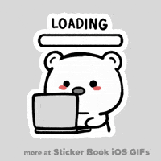

<!-- 二次元看板娘挂件 -->

  
  <!-- 引入 Live2D 看板娘脚本 (waifu.css 和 live2d.js) -->
  <!-- 注意：由于 GitHub 安全策略，直接在 README 运行复杂的 JS 可能会被拦截。
       最稳妥的方式是使用第三方提供的 README 专用挂件或图片。 -->

  <!-- 方案 A: 简单的二次元欢迎语和动态图 -->
  <h1>✨ 欢迎来到我的二次元小窝! ✨</h1>
  

  
这里是 <strong>kerriemontgomery10861-debug</strong> 的代码世界~

  <!-- 二次元风格徽章 -->
  

    
    
    
  

  

  <!-- 方案 B: 尝试引入轻量级看板娘 (部分浏览器可能不支持自动播放) -->
  <!-- 这是一个纯 CSS/HTML 的简单模拟，兼容性最好 -->
  <table>
    <tr>
      <td align="center">
        
         
        你好呀！我是看板娘 Haru ~
      </td>
      <td align="left">
        <h3>关于我</h3>
        <ul>
          <li>🌸 喜欢写代码的二次元爱好者</li>
          <li>🎮 游戏 | 动漫 | 编程</li>
          <li>💖 正在努力学习前端开发中...</li>
        </ul>
      </td>
    </tr>
  </table>

  <h3>📊 我的代码统计</h3>
  
  <!-- 主题说明:
       theme=radical (赛博朋克风，很接近二次元)
       theme=dracula (吸血鬼风，深色系)
       theme=tokyonight (东京之夜，非常适合二次元主题)
  -->

  

   
  
  

